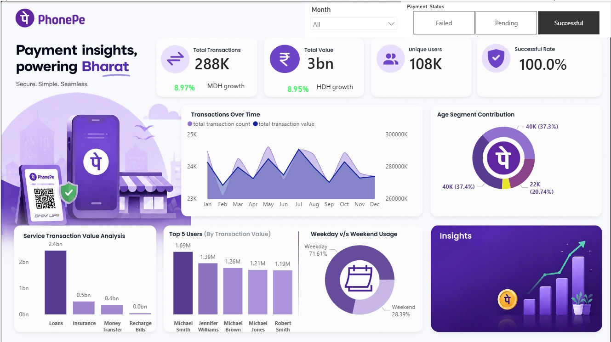

# 📊 Power BI Dashboard | PhonePe Transaction Analytics & Business Insights

<p align="center">
  
</p>

---

## 🔖 Overview

This interactive **PhonePe Business Insights Dashboard** was built using **Power BI** to transform raw digital payment transaction data into meaningful, actionable business intelligence. The dashboard provides a 360° view of payment trends, user behavior, service performance, and success metrics — enabling data-driven decision-making for digital payment platforms.

---

## 📌 Key KPIs

| Metric | Value |
|---|---|
| 💳 Total Transactions | 288K+ |
| 💰 Total Transaction Value | ₹3 Billion |
| 👥 Unique Users | 108K |
| ✅ Successful Rate | 100% (Filtered) |
| 📈 MDH Growth | 8.97% |
| 📈 HDH Growth | 8.95% |

---

## 📊 Dashboard Features

- **KPI Cards** — Total Transactions, Total Value, Unique Users, Success Rate with growth indicators
- **Transactions Over Time** — Dual-axis area chart showing monthly count vs. value trends (Jan–Dec)
- **Service Transaction Value Analysis** — Bar chart comparing Loans, Insurance, Money Transfer, and Recharge Bills
- **Age Segment Contribution** — Donut chart breaking down user demographics by generation
- **Top 5 Users by Transaction Value** — Bar chart ranking highest-value users
- **Weekday vs. Weekend Usage** — Donut chart showing 71.61% weekday vs. 28.39% weekend split
- **Interactive Filters** — Month slicer + Payment Status toggle (Failed / Pending / Successful)
- **Insights Panel** — Visual business summary section

---

## 💡 Key Business Insights

- 🏦 **Loans** generated the highest transaction value at ₹2.4 Billion — far ahead of Insurance (₹0.5bn) and Money Transfer (₹0.4bn)
- 📅 **Weekday transactions** dominate at **71.61%** vs. 28.39% on weekends — indicating strong working-hour payment activity
- 👤 **Age segments are nearly equal** across three groups (~37.4%, 37.3%, 20.74%), with two dominant segments driving most volume
- 🌟 **Top user (Michael Smith)** transacted ₹1.69M, significantly ahead of others, indicating high-value enterprise or power users
- ✅ **Payment success rate reaches 100%** when filtering for successful transactions — confirming platform reliability
- 📈 Consistent **8.95–8.97% month-over-month growth** signals healthy platform adoption

---

## 🛠️ Tools & Technologies

| Tool | Usage |
|---|---|
| **Power BI Desktop** | Dashboard creation & visualization |
| **Power Query** | Data cleaning & transformation |
| **DAX** | Calculated measures & KPIs |
| **Data Modeling** | Table relationships & schema design |

---

## 📁 Project Structure

```
PhonePe-PowerBI-Dashboard/
│
├── PhonePe_Dashboard.pbix       # Power BI project file
├── dashboard.png                # Dashboard preview image
├── dataset/
│   └── phonepe_transactions.csv # Raw transaction data (if shareable)
└── README.md                    # Project documentation
```

---

## 🚀 How to Use

1. Clone or download this repository
2. Open `PhonePe_Dashboard.pbix` in **Power BI Desktop**
3. If prompted, refresh the data source by pointing to your local dataset path
4. Use the **Month slicer** and **Payment Status toggle** to explore filtered insights
5. Hover over charts for tooltips and drill-through details

---

## 📸 Dashboard Preview

> The dashboard above shows the **"Successful"** payment status filter applied.
> Toggle to **Failed** or **Pending** to explore different transaction states.

---

## 🙋 Author

**[Your Name]**
📧 [your.email@example.com]
🔗 [LinkedIn Profile URL]
💼 [Portfolio URL]

---

## ⭐ If you found this helpful, please give it a star!

> *Built with 💜 using Power BI — Powering Bharat's Payment Insights*
